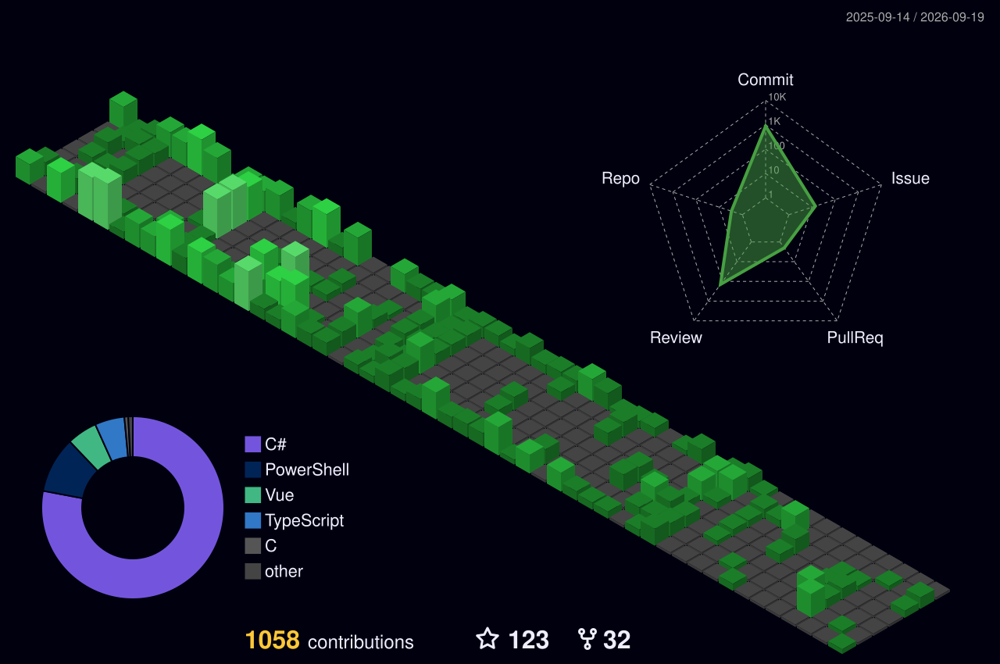

## 你好 👋

我是 HelloWRC，一个大学在读学生。我平时喜欢写一些有意思的小东西。

## 总览

  
更多信息…

  

## 项目

我创建的/我主要参与的项目：

- **[ClassIsland/ClassIsland ](https://github.com/ClassIsland/ClassIsland/)**
   
  一款适用于班级多媒体屏幕的课表的信息显示工具，可以一目了然地显示各种信息。
- **[ClassIsland/ManagementServer ](https://github.com/ClassIsland/ManagementServer/)**
   
  ClassIsland 集控服务器。

暂停/停止维护的项目

这些项目已经暂停或停止维护，不建议再使用了。

- ~~**[HelloWRC/StickyHomeworks ](https://github.com/HelloWRC/StickyHomeworks/)**~~
   
  一款支持富文本的桌面作业贴工具。如需继续使用，可以使用 Fork **[Sticky-attention/Sticky-attention ](https://github.com/Sticky-attention/Sticky-attention/)**
- ~~**[HelloWRC/W-DesktopCountdown ](https://github.com/HelloWRC/W-DesktopCountdown/)**~~

## 开发

- 我主要使用的编程语言： 
  
  
  
- 我主要使用的框架： 
  
  
- 我主要使用的开发工具： 
  
  
  
  
  

## 与我联系

- 电子邮件（ClassIsland）：<wrc@classisland.tech>
- 电子邮件（其它）：<hello_wrc@outlook.com>

<!--
**HelloWRC/HelloWRC** is a ✨ _special_ ✨ repository because its `README.md` (this file) appears on your GitHub profile.

Here are some ideas to get you started:

- 🔭 I’m currently working on ...
- 🌱 I’m currently learning ...
- 👯 I’m looking to collaborate on ...
- 🤔 I’m looking for help with ...
- 💬 Ask me about ...
- 📫 How to reach me: ...
- 😄 Pronouns: ...
- ⚡ Fun fact: ...
-->
